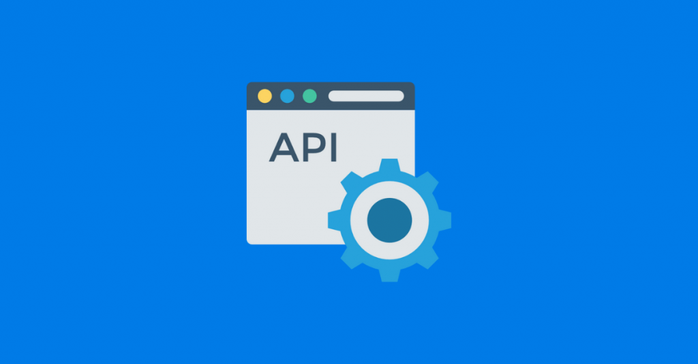
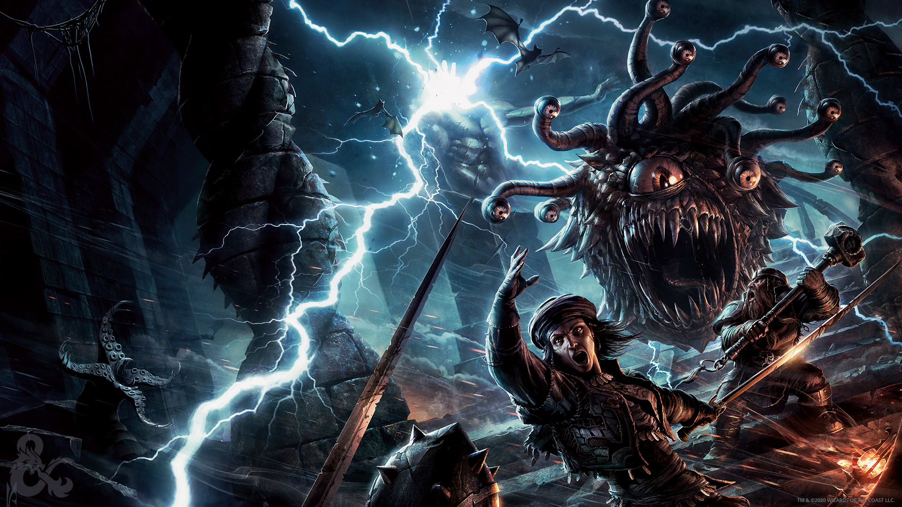
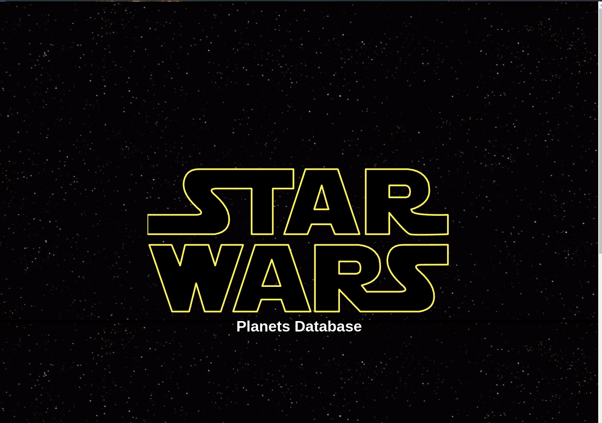
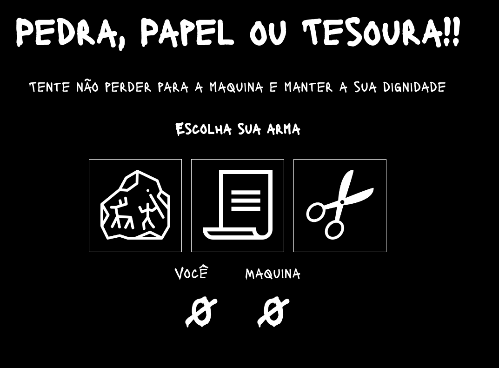
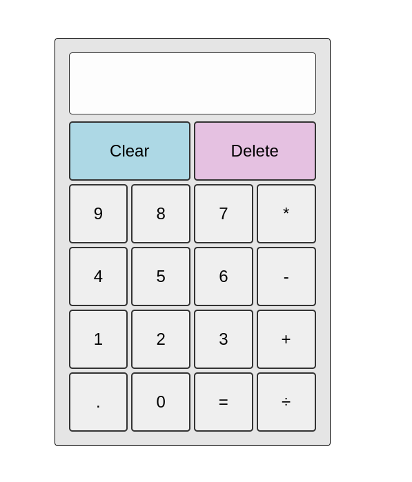
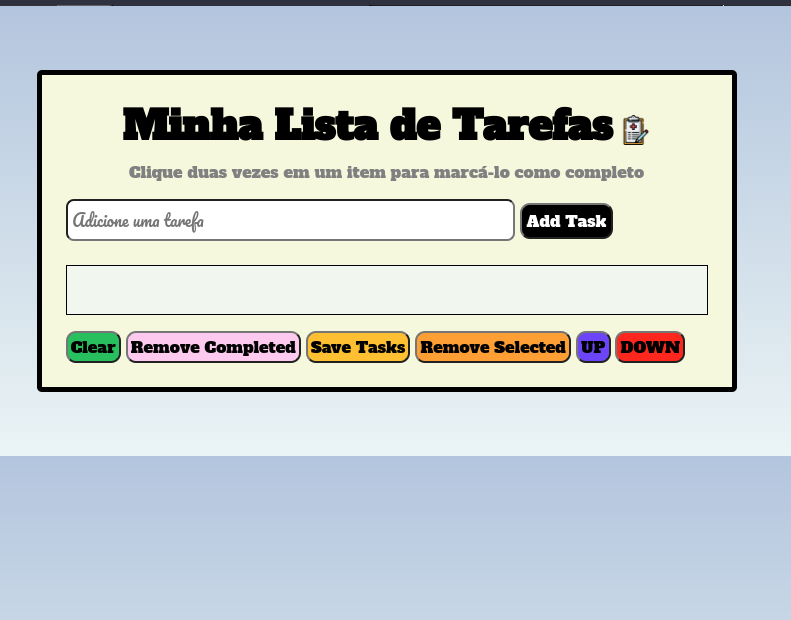

### Oi, eu sou o Gustavo Santos👋

- 💻 Estudante de Desenvolvimento de Software na [42SP](https://www.42sp.org.br/);
- 🖥 Estudante de Desenvolvimento Web na [Trybe](https://www.betrybe.com/)
- ⚡ Fun fact: Sou um repositorio de cultura inutil e aleatoriedades.

 

  <a href="https://github.com/GusttavoCDN">
  
  

 

 
 
 
 
 
 
 
 
 
 
 
 
 
 
 
 
 
             

 
  ##
  
  
 
  
  
  
  
  
  ##
  
  
 
  
 

<h1 align="center">Projetos</h1>

<table>
 <tr>
     <td valign="top" width="50%">
      <h2 align="center">Blog API</h2>
      
      
<em><strong>:wrench: Ferramentas:</strong>NodeJS, Sequelize, MySQL, Express, Swagger, Docker</em>

      

        <a href="https://github.com/GusttavoCDN/blog_api">Repositorio</a>
      
   
    </td>
    <td valign="top" width="50%">
      <h2 align="center">Trybers and Dragons</h2>
      
      
<em><strong>:wrench: Ferramentas:</strong> TypeScript, POO,</em>

      

        <a href="https://github.com/GusttavoCDN/ts_trybers_and_dragons">Repositorio</a>
      
   
    </td>
  </tr>
  <tr>
     <td valign="top" width="50%">
      <h2 align="center">Portfolio</h2>
      
      
<em><strong>:wrench: Ferramentas:</strong> React Hooks, HTML, SASS, JavaScript</em>

      

        <a href="https://gusttavocdn.github.io/portfolio/">Preview</a>,
        <a href="https://github.com/GusttavoCDN/portfolio">Repositorio</a>
      
   
    </td>
    <td valign="top" width="50%">
      <h2 align="center">Star Wars Database</h2>
      
      
<em><strong>:wrench: Ferramentas:</strong> React Hooks, Context API, HTML, CSS, JavaScript</em>

      

        <a href="https://gusttavocdn.github.io/star-wars-data-table/">Preview</a>,
        <a href="https://github.com/GusttavoCDN/star-wars-data-table">Repositorio</a>
      
   
    </td>
  </tr>
   <tr>
    <td valign="top" width="50%">
      <h2 align="center">Frontend Online Store</h2>
      
      
<em><strong>:wrench: Ferramentas: </strong> React, Redux, Sass, HTML, CSS, JavaScript, React Router v5</em>

      

        <a href="https://gusttavocdn.github.io/front_end_online_store/">Preview</a>,
        <a href="https://github.com/GusttavoCDN/front_end_online_store">Repositorio</a>
      
   
    </td>
    <td valign="top" width="50%">
      <h2 align="center">Jokenpo</h2>
      
      
<em><strong>:wrench: Ferramentas:</strong>HTML, CSS, JavaScript</em>

      

        <a href="https://gusttavocdn.github.io/Jo-ken-po/">Preview</a>,
        <a href="https://github.com/GusttavoCDN/Jo-ken-po">Repositorio</a>
      
   
    </td>
     
  </tr>
   <tr>
    <td valign="top" width="50%">
      <h2 align="center">Calculadora JavaScript</h2>
      
      
<em><strong>:wrench: Ferramentas:</strong> HTML, CSS, JavaScript</em>

      

        <a href="https://gusttavocdn.github.io/calculadora/">Preview</a>,
        <a href="https://github.com/GusttavoCDN/calculadora">Repositorio</a>
      
   
    </td>
    <td valign="top" width="50%">
      <h2 align="center">Todo List</h2>
      
      
<em><strong>:wrench: Ferramentas: </strong>HTML, CSS, JavaScript</em>

      

        <a href="https://gusttavocdn.github.io/todo-list/">Preview</a>,
        <a href="https://github.com/GusttavoCDN/todo-list">Repositorio</a>
      
   
    </td>
  </tr>
</table>

<h1 align="center">42SP Projetos</h1>

<table align="center">
  <tr>
    <td valign="top" width="50%">
      <h2 align="center">Born2beroot</h2>
      
      
<em><strong>:wrench: Ferramentas:</strong> VirtualBox, C, ShellScript, Debian</em>

      

        <a href="https://github.com/GusttavoCDN/born2beroot">Repositorio</a>
      
   
    </td>
     <td valign="top" width="50%">
      <h2 align="center">FT_PRINTF </h2>
      
      
<em><strong>:wrench: Ferramentas: </strong> C, Makefile</em>

      

        <a href="https://github.com/GusttavoCDN/ft_printf">Repositorio</a>
      
   
    </td>
  </tr>
   <tr>
    <td valign="top" width="50%">
      <h2 align="center">Get Next Line</h2>
      
      
<em><strong>:wrench: Ferramentas:</strong> C, Makefile</em>

      

        <a href="https://github.com/GusttavoCDN/get_next_line">Repositorio</a>
      
   
    </td>
     <td valign="top" width="50%">
      <h2 align="center">LIBFT</h2>
      
      
<em><strong>:wrench: Ferramentas: </strong>C, Makefile</em>

      

        <a href="https://github.com/GusttavoCDN/libft">Repositorio</a>
      
   
    </td>
  </tr>
</table>
